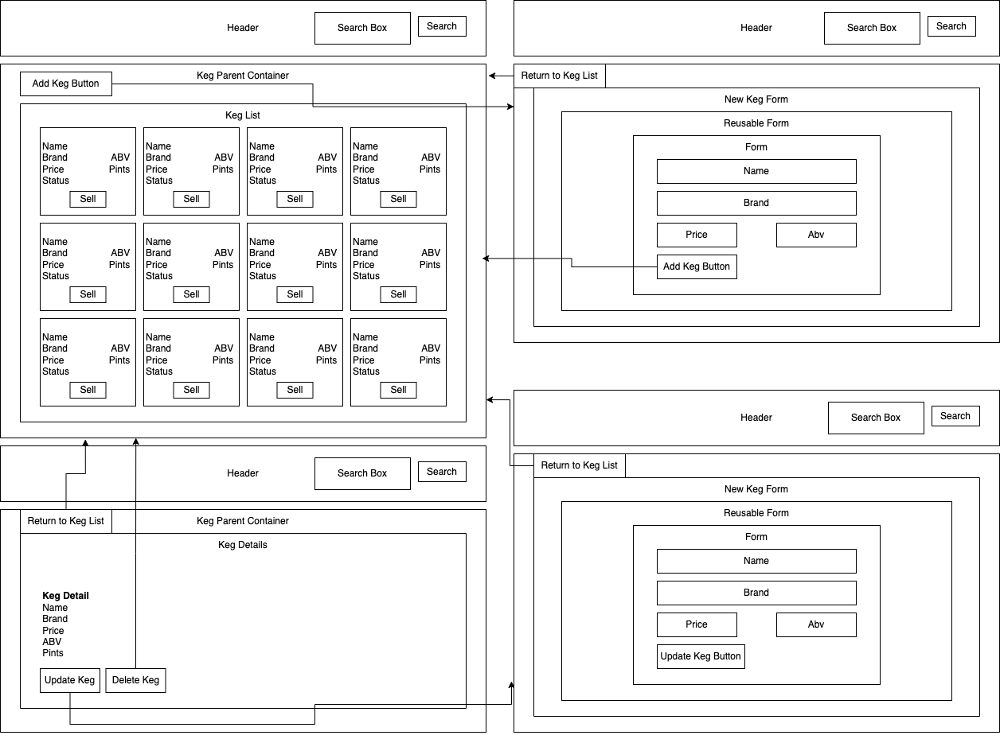

# Tap Room

#### Tap Room allows bar to track their kegs.

#### By Anastasiia Riabets

## Technologies Used

- CSS
- HTML
- JavaScript
- jQuery
- Node.js
- React

## Description


Tap Room allows bar to track their kegs.

## Setup/Installation Requirements

- Click on or copy and paste this [GitHub Page](https://anastasiia-ria.github.io/tap-room/) into your preferred browser:<br>https://anastasiia-ria.github.io/tap-room/

  **_OR_**

- Clone this repository to your Desktop:
  1. Your computer will need to have GIT installed. If you do not currently have GIT installed, follow [these](https://docs.github.com/en/get-started/quickstart/set-up-git) directions for installing and setting up GIT.
  2. Once GIT is installed, clone this repository by typing following commands in your command line:
     ```
     ~ $ cd Desktop
     ~/Desktop $ git clone https://github.com/anastasiia-ria/tap-room.git
     ~/Desktop $ cd tap-room
     ```
  3. Install necessary dependencies:
     ```
     ~/Desktop/tap-room $ npm install
     ```
  4. Run:
     ```
     ~/Desktop/tap-room $ npm run start
     ```

## Known Bugs

-

## License

[ISC](https://opensource.org/licenses/ISC)

Copyright (c) 04/22/2022 Anastasiia Riabets
